# KKBox Churn & Revenue Risk Analytics

End-to-end subscription analytics project built on KKBox churn data. The project predicts user churn risk, quantifies revenue exposure, and turns model outputs into retention actions that a business team can use.

## Live Deliverables

- **Final business report:** [`reports/report.pdf`](reports/report.pdf)
- **Tableau Public dashboard:** <https://public.tableau.com/app/profile/tianyi.ren4423/viz/Book1_17777346522100/D1_Overview>
- **Tableau workbook:** [`tableau/Book1.twbx`](tableau/Book1.twbx)
- **dbt project and lineage docs:** [`dbt_kkbox/`](dbt_kkbox/)
- **Tableau-ready data exports:** [`data/processed/tableau/`](data/processed/tableau/)
- **Analysis notebooks:** [`notebooks/`](notebooks/)

## What I Built

I built a complete churn and retention analytics workflow:

1. Loaded KKBox raw data into a local DuckDB analytical warehouse.
2. Built dbt models from raw sources to staging, intermediate, core, and analytics marts.
3. Created user-level churn features, monthly KPI marts, model performance outputs, segment summaries, monitoring outputs, and Tableau-ready exports.
4. Ran statistical tests to validate churn drivers such as auto-renewal, discount band, and registration channel.
5. Trained Logistic Regression and LightGBM churn models, then calibrated probabilities for revenue-risk analysis.
6. Scored 970,960 users, assigned risk bands, and mapped each band to a retention action.
7. Quantified revenue at risk and tested discount economics through ROI sensitivity analysis.
8. Designed a retention A/B test with primary metric, guardrails, and rollout decision rules.
9. Delivered Tableau dashboards and a final business report for stakeholder communication.

## Business Problem

Subscription businesses lose recurring revenue when users churn. A broad discount campaign can reduce churn, but it can also waste margin. This project answers a more practical question:

> Which users should KKBox target, how much revenue is at risk, and what retention action is financially sensible?

The project is not only a prediction exercise. It connects data modelling, statistical evidence, machine learning, dashboard storytelling, and business action.

## End-to-End Architecture

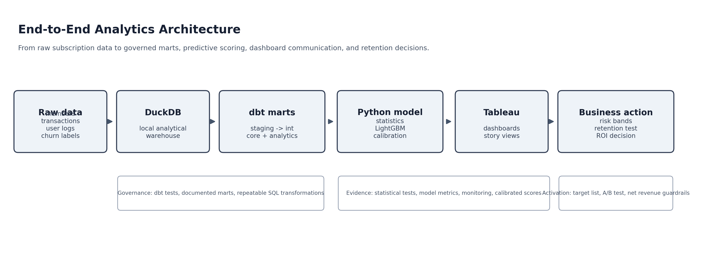

The workflow moves from raw source data to DuckDB, dbt marts, Python modelling, Tableau dashboards, and business actions. This mirrors how analytics work is usually delivered in a company: raw data is transformed into trusted tables before it becomes a model, dashboard, or decision.

## dbt Lineage

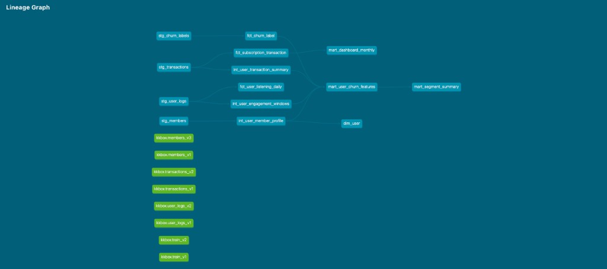

The lineage graph shows how source data flows into staging models, intermediate user summaries, core facts and dimensions, and final analytics marts such as `mart_user_churn_features`, `mart_dashboard_monthly`, and `mart_segment_summary`.

## Key Results

- **Scored users:** 970,960
- **Observed churn rate:** 9.0%
- **Calibrated LightGBM AUC:** 0.805
- **Top-decile churn recall:** 39.7%
- **Top-decile lift:** 3.97x
- **Risk-adjusted revenue exposure:** 4.64M price units
- **Critical + high-risk concentration:** 1.47% of users account for 71.5% of risk exposure

## Model Analysis Outputs

These are the main model-analysis plots produced from the Jupyter modelling workflow.

### Lift Chart

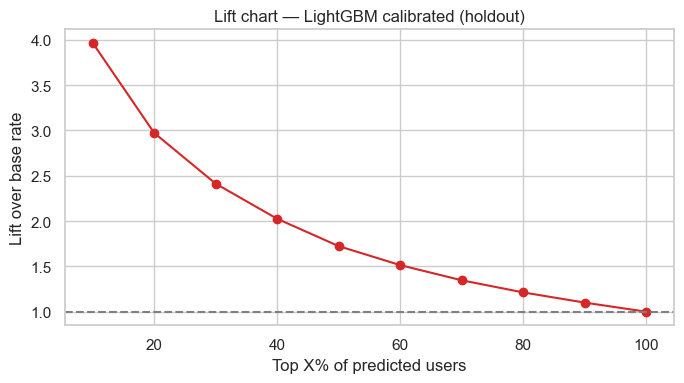

Shows how much better the calibrated LightGBM model is than random targeting when selecting the top predicted-risk users. The top decile reaches about 3.97x lift.

### Calibration Curve

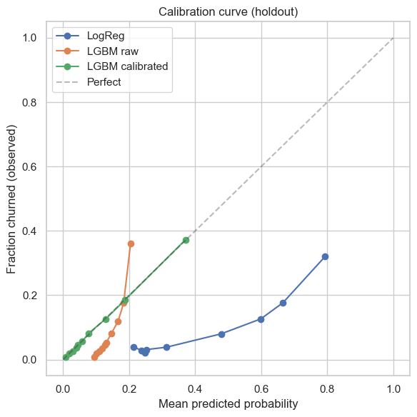

Compares Logistic Regression, raw LightGBM, and calibrated LightGBM. Calibration matters because the predicted probabilities are later used for revenue-at-risk calculations.

### SHAP Feature Importance

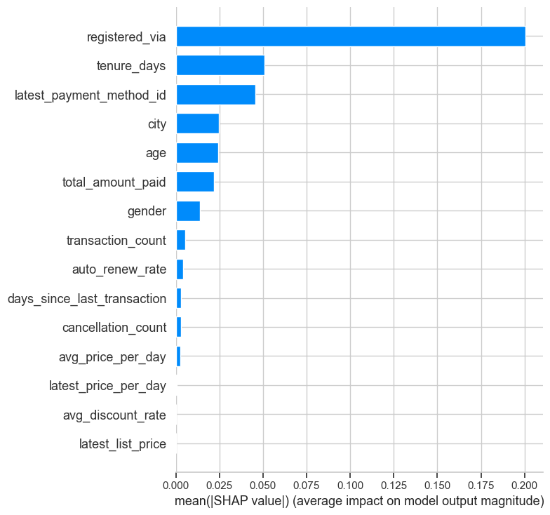

Explains which features have the largest average impact on the LightGBM churn prediction, supporting model interpretability for business review.

## Dashboard Preview

### Executive Overview

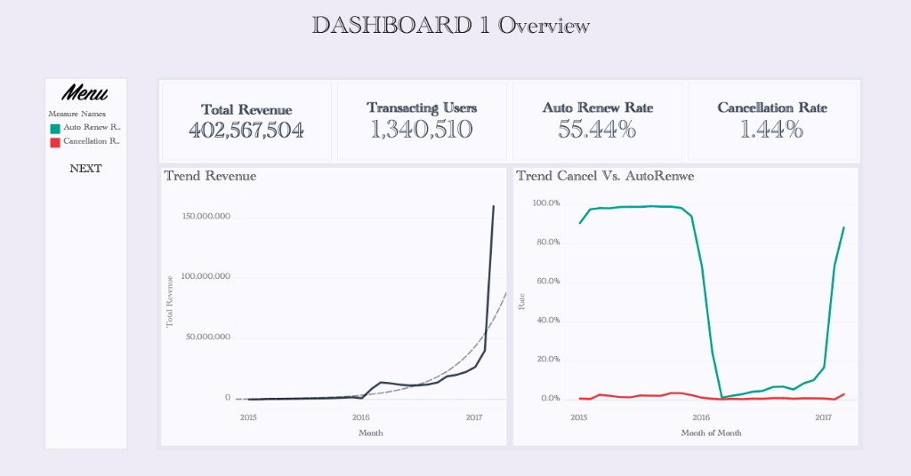

Shows revenue, transacting users, auto-renewal rate, cancellation rate, and monthly trend movement.

### Churn Drivers

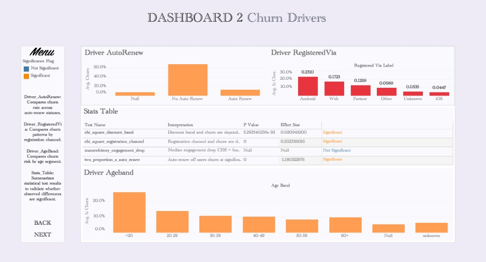

Summarises statistically supported churn drivers, including auto-renewal, registration channel, discount band, and age band.

### Model Performance

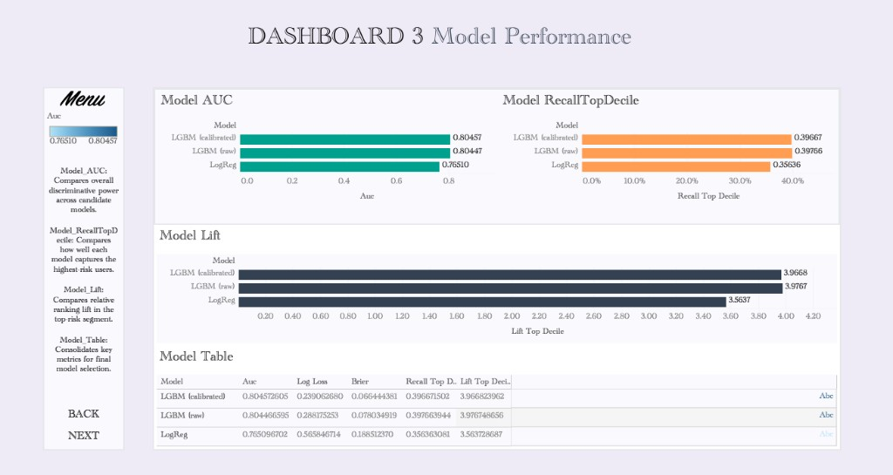

Compares Logistic Regression and LightGBM using AUC, log loss, Brier score, top-decile recall, and lift.

### Segment Revenue Risk

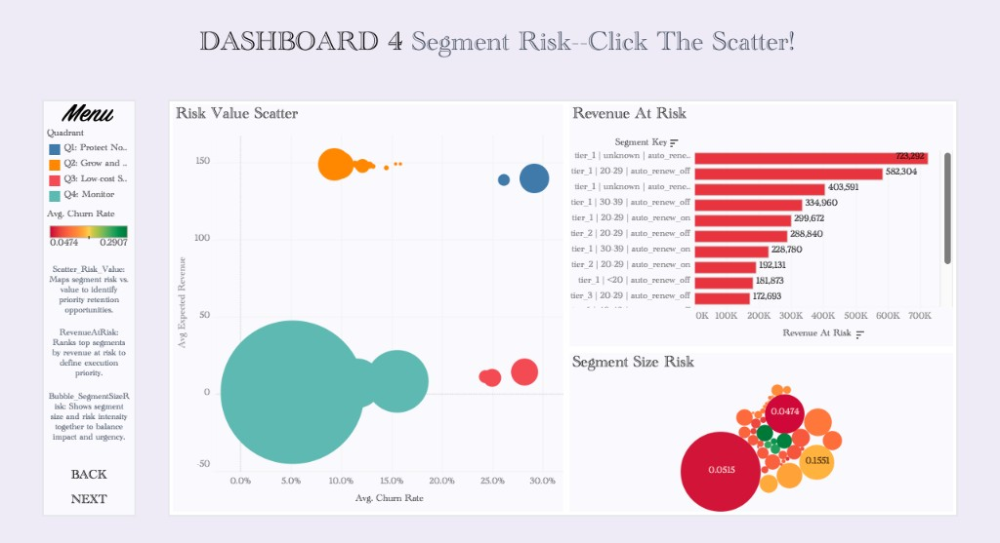

Highlights which customer segments concentrate revenue at risk and deserve retention priority.

### Retention Actions

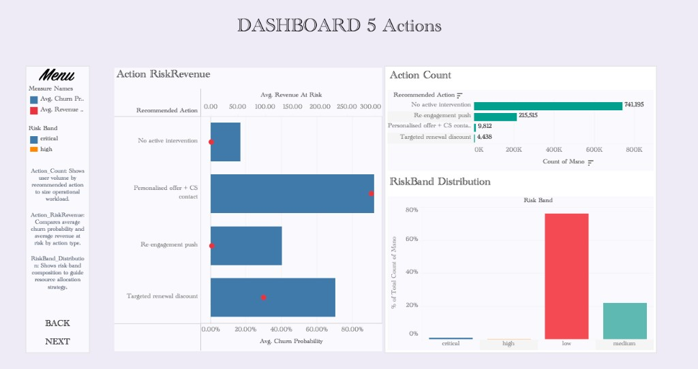

Maps risk bands to recommended actions such as no intervention, re-engagement push, targeted renewal discount, and personalised save offer.

### Model Monitoring

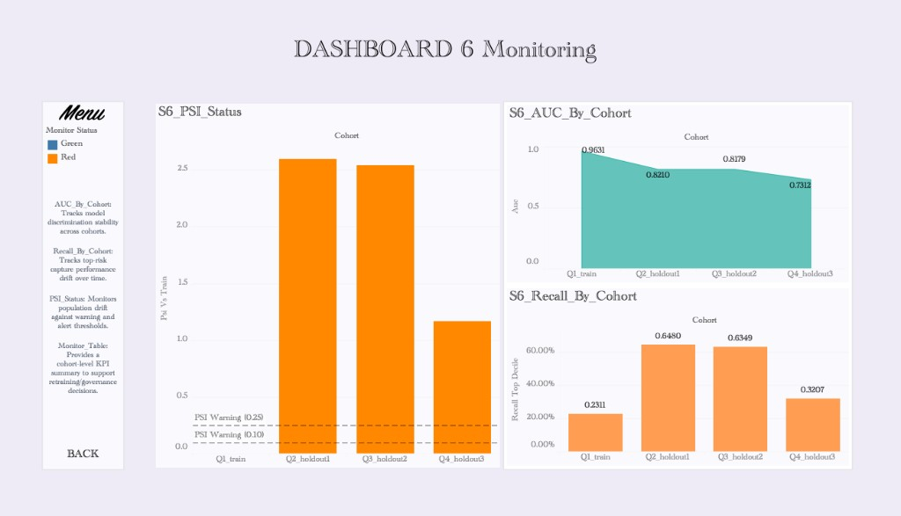

Tracks AUC, top-decile recall, and PSI across cohorts to show how the model should be monitored after deployment.

## Revenue Impact

The project separates **revenue at risk** from **campaign ROI**.

For the critical + high-risk bands:

- **Target users:** 14,250
- **Expected revenue:** 3.67M price units
- **Risk-adjusted exposure:** 3.32M price units

ROI sensitivity shows that a 10% discount can be profitable under modest churn reduction, while a 30% discount requires a much stronger treatment effect. This supports a controlled A/B test rather than an immediate broad discount rollout.

## Tech Stack

| Layer | Tools |
|---|---|
| Local warehouse | DuckDB |
| Transformation | dbt-core, dbt-duckdb |
| Analysis and modelling | Python, pandas, scikit-learn, LightGBM |
| Statistics | scipy, statsmodels |
| Monitoring | AUC by cohort, top-decile recall, PSI |
| BI | Tableau Public / Tableau Desktop Public Edition |
| Reporting | Pandoc, Tectonic, PDF report |

## Repository Structure

```text
kkbox-churn-retention-analysis/
├── README.md
├── reports/
│   └── report.pdf
├── assets/
│   ├── architecture.png
│   ├── dbt_lineage.png
│   ├── model_*.png
│   └── dashboard_*.png
├── dbt_kkbox/
│   └── models/
│       ├── staging/
│       ├── intermediate/
│       └── marts/
├── notebooks/
├── data/processed/tableau/
├── tableau/
├── docs/
├── scripts/
└── sql/
```

## Reproducibility

```bash
python3 -m venv .venv
source .venv/bin/activate
pip install -r requirements.txt

cd dbt_kkbox
DBT_PROFILES_DIR=. dbt deps
DBT_PROFILES_DIR=. dbt build
DBT_PROFILES_DIR=. dbt docs generate
cd ..

jupyter nbconvert --to notebook --execute notebooks/01_raw_data_audit.ipynb --inplace
jupyter nbconvert --to notebook --execute notebooks/02_eda_churn_drivers.ipynb --inplace
jupyter nbconvert --to notebook --execute notebooks/03_statistical_tests.ipynb --inplace
jupyter nbconvert --to notebook --execute notebooks/05_model_training.ipynb --inplace
jupyter nbconvert --to notebook --execute notebooks/06_segment_revenue_risk.ipynb --inplace
jupyter nbconvert --to notebook --execute notebooks/07_model_monitoring_sim.ipynb --inplace
```

## Hiring-Relevant Skills Demonstrated

- SQL modelling and analytics engineering with dbt
- Warehouse-style transformation design in DuckDB
- Statistical testing and evidence-based churn driver analysis
- Churn modelling with baseline and boosted models
- Business-oriented model evaluation using lift and top-decile recall
- Revenue-at-risk and ROI sensitivity analysis
- A/B test design with guardrail metrics
- Tableau dashboard storytelling
- dbt lineage, documentation, and production-style workflow thinking

